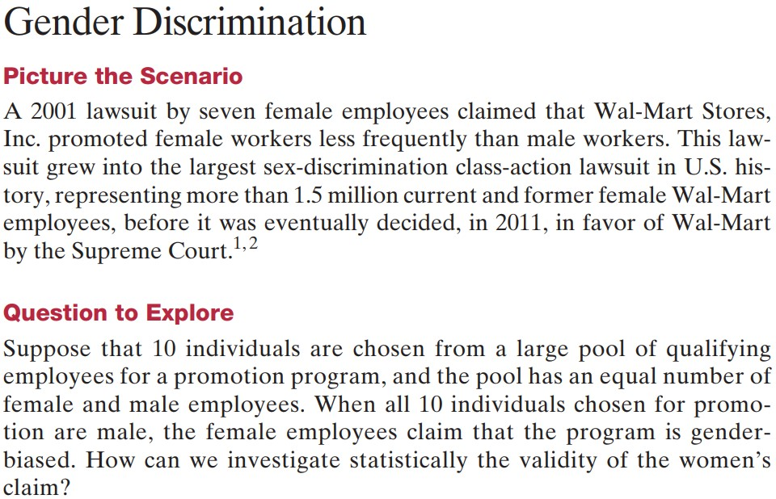
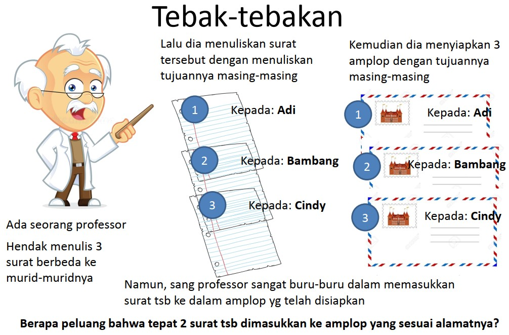

```{r xaringanExtra, echo=FALSE}
xaringanExtra::use_xaringan_extra(c("tile_view", "animate_css", "tachyons"))
```

```{r xaringan-panelset, echo=FALSE}
xaringanExtra::use_panelset()
```

```{r xaringan-scribble, echo=FALSE}
xaringanExtra::use_scribble()
```

```{r xaringan-logo, echo=FALSE}
xaringanExtra::use_logo(
  image_url = "Unsera.png"
)
```

```{r xaringanExtra-webcam, echo=FALSE}
xaringanExtra::use_webcam()
```

```{r xaringanExtra-search, echo=FALSE}
xaringanExtra::use_search(show_icon = TRUE)
```


.pull-left[


]

.pull-right[
<br>
# **.purple[Outline]**

# 1. Ruang Contoh dan Kejadian
# 2. Menghitung Peluang

]

---



---

class: inverse, middle, center
# **.blue[Mengapa] kita**
# **perlu .green[belajar]**
# .red[**Peluang**]
# **???**

---

background-image: url("gb_03.jpg")

class: bottom

#**Uncertainty is around us**

---
<br>
.pull.center[

#.red[**Ketidakpastian**]

]

--

.pull.center[

# $\big\Downarrow$

# .yellow[**Pengambilan Keputusan**]

]

--

.pull.center[
# $\big\Downarrow$

# .green[**Konsep Peluang!**]
]

---

.pull.center[
# **Ketidakpastian bersifat .red[Acak]**
]

.pull-left[

- ###Suatu fenomena dikatakan .red[ACAK] jika bersifat .red[**tidak pasti**]
- ###Fenomena .red[ACAK] sering mengikuti suatu pola tertentu
- ###Keteraturan .red[ACAK] dalam jangka panjang dapat didekati secara matematika

]

.pull-right[
- ###Studi matematika mengenai .red[KEACAKAN] $\Rightarrow$ .red[TEORI PELUANG] – peluang merupakan suatu bentuk matematika dari sifat acak tersebut
- ###Dengan ilmu peluang, kita dapat membuat daftar serentetan kemungkinan kejadian yang dapat terjadi
]

---
.pull.center[
# **Ketidakpastian**
]
- ##Jika kita melemparkan sebuah mata uang logam, apakah yang akan keluar? Apakah sisi angka? Apakah sisi gambar?
- ##Jika kita mengambil sebuah kartu dari satu set kartu bridge, apakah kita akan mendapatkan kartu King?
- ##JIka seseorang mendapati hasil negatif pada tes antigen Covid-19, apakah memang benar dia tidak terpapar Covid-19?

---

.pull.center[
# **Pengertian Peluang**
]

- ##**Peluang (_probability_)** $\Rightarrow$ cara menyatakan .red[**ketidakpastian**] ke dalam bentuk .red[**angka**]


- ##**Peluang** $\Rightarrow$ suatu ukuran atau nilai yang menyatakan kemungkinan terjadinya sebuah kejadian acak.

---

.pull.center[
# **Pengertian Peluang**
]

##Pada hakekatnya, dasar perumusan tentang peluang atau penentuan ukuran yang dapat mengukur tingkat kepastian timbulnya suatu kejadian dapat dibedakan dalam 3 cara 

- ##Perumusan Peluang Klasik
- ##Perumusan Peluang secara Frekuensi Relatif
- ##Perumusan Peluang secara Subyektif

---

.pull.center[
# **Pengertian Peluang**
]

###.red[Peluang Klasik] : Jika suatu percobaan dapat menghasilkan $N$ titik contoh yang saling berpeluang sama, dan jika tepat ada sebanyak $n$ dari titik contoh tersebut merupakan unsur dari kejadian $A$, maka peluang kejadian $A$ adalah $P(A) = n/N$ (Asumsi : setiap titik contoh memiliki peluang muncul yang sama)

--

### .red[Peluang Frekuensi Relatif] : Misalkan $S$ adalah suatu ruang contoh, $A$ adalah suatu kejadian, dan n(A) adalah frekuensi munculnya kejadian $A$ jika percobaan diulang sebanyak $n$ kali. Peluang kejadian $A$ adalah : $P(A) = n(A)/n$

--
###.red[Peluang secara Subyektif] : bergantung pada keyakinan subyektif masing-masing

---

.pull.center[

]

---

- ## Percobaan (_experiment_)
   Suatu aktivitas atau kegiatan yang memberikan hasil yang acak. Misalnya: Melempar sebuah dadu sisi 6 satu kali.
- ## Hasil (_outcome_)
  Hasil yang mungkin dari suatu percobaan. Himpunan semua hasil yang mungkin dari suatu percobaan disebut Ruang Contoh (Ruang Sampel). Ruang contoh biasa dinotasikan dengan huruf $S$ dan banyaknya anggota $S$ dinotasikan dengan $n(S)$. Pada pelemparan sebuah dadu sisi 6, maka ruang contohnya adalah $S=\{1, 2, 3, 4, 5, 6\}$ dengan $n(S)=6$.
- ## Kejadian (_event_)
  Himpunan bagian dari ruang contoh yang memiliki karkteristik tertentu. Kejadian dinotasikan dengan huruf kapital, misalkan kejadian $A$ adalah terpilihnya sisi dadu genap. Maka $A=\{2,4,6\}$ dengan banyaknya anggota $A$ adalah $n(A)=3$.

---

- ## Percobaan
  ### Melempar sebuah mata uang logam dua kali.
- ## Ruang Contoh
  ### Jika sebuah mata uang logam terdiri atas sisi angka $(A)$ dan sisi gambar $(G)$, maka $S=\{AA, AG, GA, GG \}$
- ## Ruang Kejadian
  ### Misalkan $B$ adalah kejadian munculnya dua sisi yang sama, maka $B=\{AA, GG \}$

---

background-image: url("gb_05.jpg")

---

background-image: url("gb_06.jpg")

---

class: middle, center

# Berapa banyak anggota ruang contoh jika pertanyaan pada Pop Quiz di atas terdiri atas .red[**5 pertanyaan**], .red[**10 pertanyaan**], atau .red[**20 pertanyaan**]?

